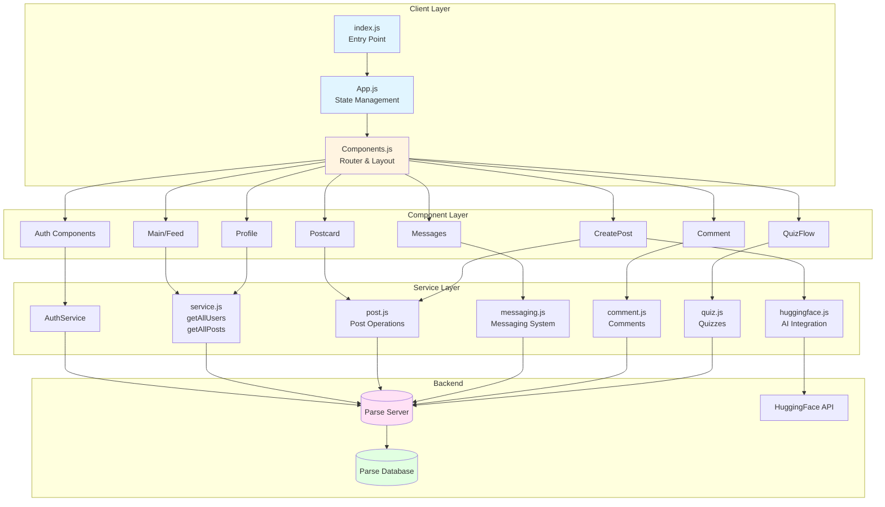
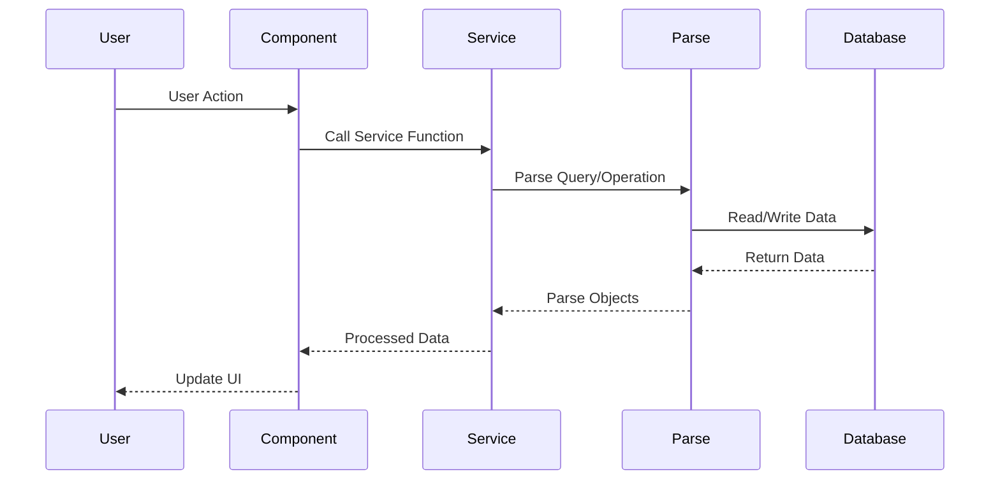
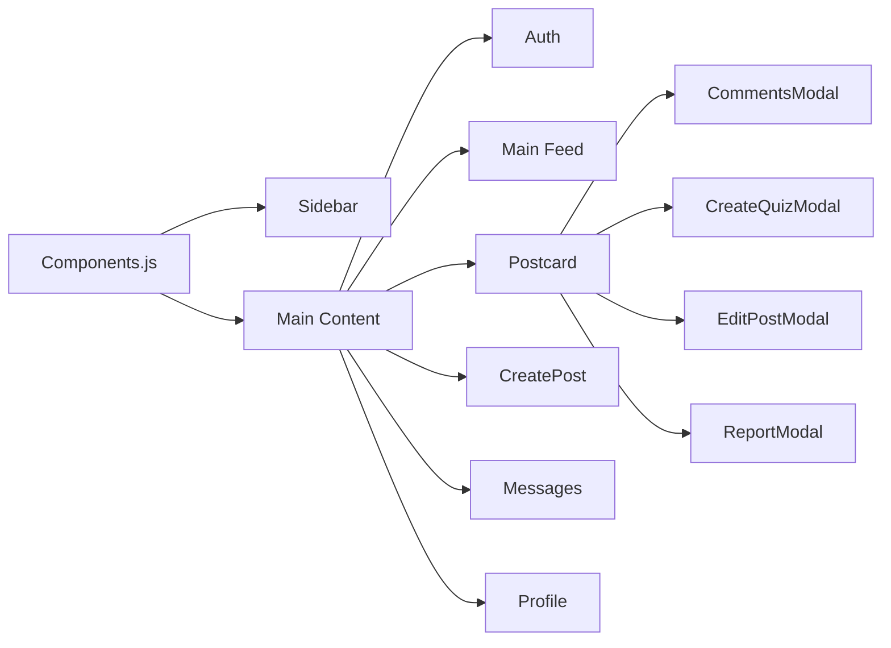
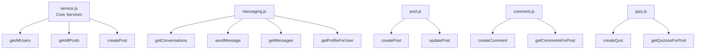

# Core Architecture Diagram

## System Architecture

```mermaid
graph TB
    subgraph "Client Layer"
        A[index.js<br/>Entry Point] --> B[App.js<br/>State Management]
        B --> C[Components.js<br/>Router & Layout]
    end
    
    subgraph "Component Layer"
        C --> D[Auth Components]
        C --> E[Main/Feed]
        C --> F[Postcard]
        C --> G[CreatePost]
        C --> H[Messages]
        C --> I[Profile]
        C --> J[Comment]
        C --> K[QuizFlow]
    end
    
    subgraph "Service Layer"
        D --> L[AuthService]
        E --> M[service.js<br/>getAllUsers<br/>getAllPosts]
        F --> N[post.js<br/>Post Operations]
        G --> N
        H --> O[messaging.js<br/>Messaging System]
        I --> M
        J --> P[comment.js<br/>Comments]
        K --> Q[quiz.js<br/>Quizzes]
        G --> R[huggingface.js<br/>AI Integration]
    end
    
    subgraph "Backend"
        L --> S[(Parse Server)]
        M --> S
        N --> S
        O --> S
        P --> S
        Q --> S
        R --> T[HuggingFace API]
        S --> U[(Parse Database)]
    end
    
    style A fill:#e1f5ff
    style B fill:#e1f5ff
    style C fill:#fff4e1
    style S fill:#ffe1f5
    style U fill:#e1ffe1
```

## Data Flow

```mermaid
sequenceDiagram
    participant User
    participant Component
    participant Service
    participant Parse
    participant Database
    
    User->>Component: User Action
    Component->>Service: Call Service Function
    Service->>Parse: Parse Query/Operation
    Parse->>Database: Read/Write Data
    Database-->>Parse: Return Data
    Parse-->>Service: Parse Objects
    Service-->>Component: Processed Data
    Component-->>User: Update UI
```

## Component Hierarchy

```mermaid
graph LR
    A[Components.js] --> B[Sidebar]
    A --> C[Main Content]
    
    C --> D[Auth]
    C --> E[Main Feed]
    C --> F[Postcard]
    C --> G[CreatePost]
    C --> H[Messages]
    C --> I[Profile]
    
    F --> J[CommentsModal]
    F --> K[CreateQuizModal]
    F --> L[EditPostModal]
    F --> M[ReportModal]
```

## Service Layer Structure

```mermaid
graph TD
    A[service.js<br/>Core Services] --> B[getAllUsers]
    A --> C[getAllPosts]
    A --> D[createPost]
    
    E[messaging.js] --> F[getConversations]
    E --> G[sendMessage]
    E --> H[getMessages]
    E --> I[getProfileForUser]
    
    J[post.js] --> K[createPost]
    J --> L[updatePost]
    
    M[comment.js] --> N[createComment]
    M --> O[getCommentsForPost]
    
    P[quiz.js] --> Q[createQuiz]
    P --> R[getQuizzesForPost]
```

